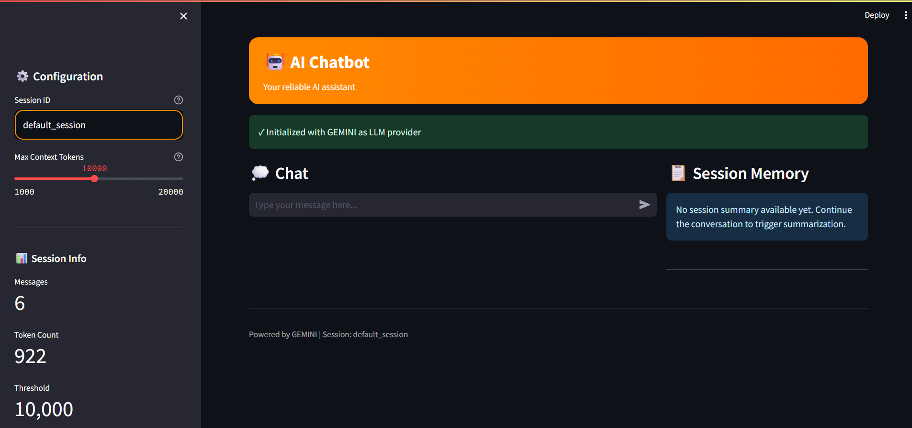

# Chat Bot with Memory

A production-ready conversational AI assistant with advanced memory management, session persistence, query understanding, and real-time deployment capability.

## App Interface



*Streamlit-based web interface with rich markdown support, styled chat bubbles, and orange theme for an intuitive conversational experience.*

## Features

### Current Features ✅

- **Conversation Memory**: Persistent session storage with automatic context retrieval
- **Session Summarization**: Token-aware summarization when conversations exceed threshold (default 10K tokens)
- **Query Understanding**: 
  - Ambiguous query detection
  - Query rewriting for clarity
  - Context augmentation
  - Clarifying question generation
- **Multi-LLM Support**: 
  - Google Gemini (primary)
  - Ollama (local/self-hosted fallback)
- **Conversation Logging**: Automatic JSON Lines logging with metadata (timestamps, token counts, ambiguity flags)
- **Rich UI**: Streamlit-based web interface with markdown rendering, styled chat bubbles, orange theme
- **Comprehensive Testing**: 6 test suites covering core functionality

## Query Understanding Pipeline

### 🔄 New Workflow (v1.0+)

The query understanding pipeline processes every user query through 6 sequential steps to ensure clarity before LLM response generation:

```mermaid
graph TD
    A["🔤 USER QUERY"]
    B["STEP 1: SPELLING CHECK<br/>Rule-based | No LLM<br/>Correct typos & grammar"]
    C["STEP 2: AMBIGUITY DETECTION<br/>🤖 Gemini fallback<br/>6 heuristic rules first"]
    D["CONTINUE ✓"]
    E["Fixable with context?"]
    F["STEP 6b: CLARIFYING QUESTIONS<br/>🤖 Gemini<br/>Ask user for clarity"]
    G["STEP 3: ANSWERABILITY CHECK<br/>🤖 MiniLM<br/>Similarity matching"]
    H["CONTINUE ✓"]
    I["CLARIFYING QUESTIONS"]
    J["STEP 4: CONTEXT RETRIEVAL<br/>Rule-based | No LLM<br/>Memory augmentation"]
    K["STEP 5: QUERY REFINEMENT<br/>🤖 Qwen 2.5-1.5B<br/>Pronoun → Entity"]
    L["STEP 6: LLM RESPONSE GENERATION<br/>🤖 Gemini<br/>Generate + log"]
    M["✅ RESPONSE + METADATA<br/>Answer | Tokens | Refinement"]

    A --> B --> C
    C -->|CLEAR| D
    C -->|AMBIGUOUS| E
    E -->|YES| D
    E -->|NO| F
    D --> G
    G -->|ANSWERABLE| H
    G -->|NOT ANSWERABLE| I
    H --> J --> K --> L --> M
    F --> M
    I --> M

    class A input
    class B,J stepNeutral
    class C,L stepOrange
    class D,H success
    class E decision
    class F,I danger
    class G,K stepPurple
    class M success

    classDef input fill:#e3f2fd,stroke:#0d47a1,stroke-width:3px,color:#0d47a1,font-weight:bold
    classDef stepNeutral fill:#eeeeee,stroke:#424242,stroke-width:3px,color:#212121,font-weight:bold
    classDef stepOrange fill:#ffe0b2,stroke:#e65100,stroke-width:3px,color:#bf360c,font-weight:bold
    classDef stepPurple fill:#e1bee7,stroke:#6a1b9a,stroke-width:3px,color:#4a148c,font-weight:bold
    classDef success fill:#c8e6c9,stroke:#1b5e20,stroke-width:3px,color:#1b5e20,font-weight:bold
    classDef danger fill:#ffccbc,stroke:#bf360c,stroke-width:3px,color:#bf360c,font-weight:bold
    classDef decision fill:#fff3e0,stroke:#ef6c00,stroke-width:3px,color:#e65100,font-weight:bold
  ```

### Components

#### 1. **Spelling Checker** (`app/query_understanding/spelling_check.py`)
```python
# Corrects typos automatically
checker = SpellingChecker()
result = checker.check("whats the best libary for ML?")
# → "what's the best library for ML?"
```

#### 2. **Ambiguity Detector** (`app/query_understanding/ambiguity.py`)
```python
# Detects 6 types of ambiguous queries
detector = AmbiguityDetector(llm_client)
analysis = await detector.detect("How does it compare?", messages)
# → is_ambiguous=True, rule="RULE 1", reason="Pronoun 'it' without clear antecedent"
```

#### 3. **Query Refiner** (`app/query_understanding/query_refiner.py`)
```python
# Replaces pronouns with entities using lightweight LLM
refiner = QueryRefiner(llm_client)  # Uses Qwen2.5-1.5B by default
refined = await refiner.refine("How does it perform?")
# Cache: ["TensorFlow is fast", "PyTorch is flexible"]
# → "How does TensorFlow perform?" or "How does PyTorch perform?"
```

**Query Refinement Details:**
- **Pronoun Detection**: it, they, them, this, that, he, she
- **Entity Extraction**: From last 3 queries (lightweight cache)
- **LLM Rewriting**: Qwen2.5-1.5B model (1.5B params vs 8B for llama3.1)
- **Performance**: 2-3x faster than standard models
- **Fallback**: Auto-fallback to active LLM if Qwen unavailable

#### 4. **Context Augmenter** (`app/query_understanding/context.py`)
```python
# Intelligently retrieves session memory
augmenter = ContextAugmenter()
context, fields = augmenter.augment(
    query="How does it compare?",
    messages=messages,
    session_memory=memory,
    needed_fields=["key_facts", "decisions"]
)
```

#### 5. **Clarifying Question Generator** (`app/query_understanding/clarifier.py`)
```python
# Generates clarifying questions if query still unclear
clarifier = ClarifyingQuestionGenerator(llm_client)
questions = await clarifier.generate(
    "What should I choose?",  # Missing object
    messages=messages
)
# → ["Choose what? (library, algorithm, etc.)",
#    "What's your main priority? (speed, accuracy, etc.)",
#    "What's your use case?"]
```

---

## Logging System

The system generates **three types of detailed logs** for analysis:

### 📊 Log Types

| Log Type | File | Contents | Use Case |
|----------|------|----------|----------|
| **Conversation** | `conversations_*.log` | User-assistant pairs + metadata | Analyze conversations, user behavior |
| **User Query** | `user_queries_*.log` | Original → refined query + context | Debug ambiguity detection, refinement |
| **Session Summary** | `session_summaries_*.log` | Session facts, decisions, summary | Understand session evolution |

### 🔍 Log Structure

#### **Conversation Log** (`conversations_*.log`)
```json
{
  "timestamp": "2026-02-04T11:38:06.123456",
  "session_id": "session-123",
  "user": "How does it perform?",
  "assistant": "TensorFlow performs well for...",
  "metadata": {
    "is_answerable": true,
    "token_count": 1234,
    "summarization_triggered": false,
    "pipeline_metadata": {
      "spelling_check_used": false,
      "ambiguity_llm_used": true,
      "answerability_check_passed": true,
      "context_expanded": true,
      "refinement_applied": true,
      "llm_call_made": true
    },
    "llm_usage_percentage": "45.2%"
  }
}
```

#### **User Query Log** (`user_queries_*.log`)
```json
{
  "timestamp": "2026-02-04T11:38:06.123456",
  "session_id": "session-123",
  "original_query": "How does it perform?",
  "is_ambiguous": true,
  "rewritten_query": "How does TensorFlow perform?",
  "needed_context_from_memory": [
    "user_profile.prefs: [wants speed, flexibility]",
    "key_facts: [using TensorFlow in project]",
    "decisions: [chose TensorFlow over PyTorch]"
  ],
  "clarifying_questions": [],
  "final_augmented_context": "Recent discussion: TensorFlow chosen for project..."
}
```

#### **Session Summary Log** (`session_summaries_*.log`)
```json
{
  "timestamp": "2026-02-04T11:38:06.123456",
  "session_id": "session-123",
  "session_summary": {
    "user_profile": {
      "prefs": ["speed", "flexibility"],
      "constraints": ["budget: limited", "team: 2 engineers"]
    },
    "key_facts": [
      "Building ML system for production",
      "Team has PyTorch experience"
    ],
    "decisions": [
      "Chose TensorFlow for deployment",
      "Using transfer learning approach"
    ],
    "open_questions": [
      "How to optimize training speed?"
    ]
  },
  "message_range_summarized": {
    "from": 0,
    "to": 42
  }
}
```

---

## Running Tests & Generating Logs

### 📝 Test Scripts Location
```
tests/
├── test_ambiguous_query_detection.py    ← Ambiguity detection + all 6 rules
├── test_query_refinement.py              ← Query refinement with LLM
├── test_session_summarization.py         ← Session memory & summarization
├── test_conversation_logging.py          ← Conversation persistence
├── test_cli_demo.py                      ← CLI interface testing
├── test_streamlit_app.py                 ← Streamlit UI testing
└── run_tests.py                          ← Run all tests
```

### 🚀 Running Tests & Generating Logs

#### **1. Test Ambiguity Detection (All 6 Rules)**
```bash
# Run: Tests all 6 ambiguity rules with natural conversation
python tests/test_ambiguous_query_detection.py

# Generates logs:
# logs/ambiguous_query_detection/
# ├── conversations_test.log      (user-assistant pairs with metadata)
# ├── user_queries_test.log        (original + rewritten queries, ambiguity flags)
# └── session_summaries_test.log   (session memory evolution)

# Example output:
# [✓] Test: Ambiguous query detection
# [✓] Query 1: "We're building a machine learning system" → CLEAR (100% confidence)
# [✓] Query 3: "How does it perform?" → AMBIGUOUS (RULE 1: pronoun without antecedent)
# [✓] Query 7: "Which one do you prefer?" → AMBIGUOUS (RULE 1c: which-one without context)
# [✓] Query 23: "It?" → AMBIGUOUS (RULE 2: very short question)
# [✓] Overall: 24/28 queries correctly classified (85.7% accuracy)
```

#### **2. Test Query Refinement (Lightweight Model)**
```bash
# Run: Tests pronoun replacement with Qwen2.5-1.5B model
python tests/test_query_refinement.py

# Prerequisites: Ollama running with qwen2.5:1.5b pulled
# ollama pull qwen2.5:1.5b
# ollama serve

# Generates logs:
# logs/query_refinement/
# ├── conversations_test.log
# ├── user_queries_test.log        (shows rewritten_query field populated)
# └── session_summaries_test.log

# Example output:
# [Original] "How does it perform?"
# [Refined]  "How does TensorFlow perform?" ✓
# [Cache]    ["TensorFlow is fast", "PyTorch is flexible"]
```

#### **3. Test Session Summarization**
```bash
# Run: Tests token-aware summarization when context exceeds threshold
python tests/test_session_summarization.py

# Generates logs:
# logs/session_summarization/
# ├── conversations_test.log
# ├── user_queries_test.log
# └── session_summaries_test.log  (shows summarization_triggered + summary content)

# Example output:
# Token count: 2500
# [✓] Summarization triggered at 10000 tokens
# [✓] Extracted 5 key facts
# [✓] Tracked 3 decisions
# [✓] Found 2 open questions
```

#### **4. Run All Tests**
```bash
# Run entire test suite
python tests/run_tests.py

# Generates all logs across test directories:
logs/
├── ambiguous_query_detection/
│   ├── conversations_test.log
│   ├── user_queries_test.log
│   └── session_summaries_test.log
├── query_refinement/
│   ├── conversations_test.log
│   ├── user_queries_test.log
│   └── session_summaries_test.log
├── session_summarization/
│   ├── conversations_test.log
│   ├── user_queries_test.log
│   └── session_summaries_test.log
└── ...
```

## Quick Start

### Prerequisites
- Python 3.10+
- Docker (for containerized deployment)
- API Keys: Google Generative AI (Gemini)

### Installation

1. **Clone and Setup**
```bash
git clone <repo-url>
cd chat-bot-with-memory
python -m venv venv
source venv/bin/activate  # On Windows: venv\Scripts\activate
pip install -r requirements.txt
```

2. **Configure Environment**
```bash
cp .env.example .env
# Edit .env with your API keys:
# - GOOGLE_API_KEY
# - OLLAMA_HOST (optional, for fallback)
```

3. **Run Locally**

**Option A: CLI Demo**
```bash
python cli_demo.py
```

**Option B: Streamlit UI**
```bash
streamlit run streamlit_app.py
```

**Option C: FastAPI Backend**
```bash
python -m uvicorn app.main:app --reload --host 0.0.0.0 --port 8000
```

### Docker Deployment (Local)

**API Service**
```bash
docker build -t chat-bot-api .
docker run -e PORT=8000 -e GOOGLE_API_KEY=your-key -p 8000:8000 chat-bot-api
```

**Streamlit UI**
```bash
docker build -f Dockerfile.streamlit -t chat-bot-ui .
docker run -e PORT=8501 -p 8501:8501 chat-bot-ui
```

## File Structure

```
chat-bot-with-memory/
├── app/
│   ├── main.py              # FastAPI entry point
│   ├── api/                 # API endpoints
│   │   ├── chat.py
│   │   ├── docs.py          # Document upload (future)
│   │   └── auth.py          # Authentication (future)
│   ├── core/
│   │   ├── pipeline.py      # Main orchestrator
│   │   ├── config.py        # Configuration
│   │   ├── prompt_builder.py
│   │   └── token_counter.py
│   ├── llm/
│   │   ├── client.py        # Base LLM client
│   │   ├── gemini_client.py
│   │   ├── ollama_client.py
│   │   └── json_guard.py    # JSON parsing utilities
│   ├── memory/
│   │   ├── session_store.py # Session persistence
│   │   ├── schemas.py       # Data models
│   │   ├── summarizer.py    # Token-aware summarization
│   │   └── schemas.py
│   ├── query_understanding/
│   │   ├── ambiguity.py     # Detect ambiguous queries
│   │   ├── clarifier.py     # Generate clarifying questions
│   │   ├── context.py       # Context augmentation
│   │   ├── rewrite.py       # Query rewriting
│   │   └── schemas.py
│   ├── utils/
│   │   ├── logging.py       # ConversationLogger
│   │   └── __init__.py
│   └── __init__.py
├── tests/
│   ├── test_session_summarization.py
│   ├── test_ambiguous_query_detection.py
│   ├── test_query_refinement.py
│   ├── test_conversation_logging.py
│   ├── test_cli_demo.py
│   ├── test_streamlit_app.py
│   └── run_tests.py
├── data/                    # Persistent data
│   ├── sessions/            # Session summaries (JSON)
│   └── conversations/       # Conversation logs (JSONL)
├── logs/                    # Application logs
├── cli_demo.py              # CLI interface
├── streamlit_app.py         # Streamlit web UI
├── Dockerfile               # API service container
├── Dockerfile.streamlit     # Streamlit UI container
```

## Environment Variables

```bash
# LLM Configuration
GOOGLE_API_KEY=your-gemini-api-key
OLLAMA_HOST=http://localhost:11434  # For fallback

# Session Management
SESSION_TOKEN_THRESHOLD=10000        # Summarize at this token count
SESSION_STORAGE_TYPE=file            # or 'redis'
REDIS_URL=redis://localhost:6379     # If using Redis
```

Run specific test:
```bash
pytest tests/test_session_summarization.py -v
```

**Session Management**
```bash
# View session info
python session_manager.py -i default_session

# Delete session
python session_manager.py -d default_session

# Delete all sessions
python session_manager.py -d
```

## License

MIT

## Support

For issues, questions, or feature requests, open a GitHub issue.

---

**Last Updated**: February 2026
**Current Version**: 1.0.0
**Status**: Production Ready (Core Features)
